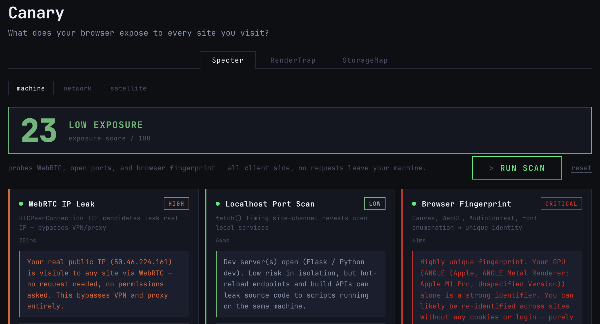
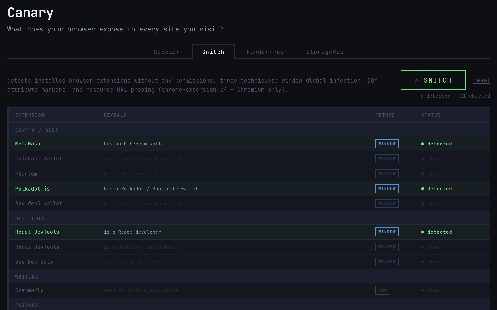

# Canary

<p align="center">
  
</p>

what does your browser expose to every site you visit? turns out, a lot.

```
npm i && npm run dev
```

passive recon tool that runs entirely client-side. no server, no tracking, no install. just open it and get existentially uncomfortable.





## tools

### Specter
three sub-tools, one tab:

**machine** — what your browser leaks about this machine:
- WebRTC IP leak — bypasses VPN/proxy to grab your real public IP via ICE candidates
- localhost port scan — fetch() timing side-channel to find open DBs, dev servers, docker daemons
- browser fingerprint — canvas, WebGL renderer, AudioContext, fonts → entropy score
- navigator leaks — CPU threads, device memory, timezone, screen, network type, the works

**network** — maps your LAN from a browser tab. no extensions, no permissions. fast TCP RST (~5–50ms) means a host is home; 1.5s timeout means nobody answered. finds alive hosts then probes common service ports on each.

**satellite** — OSINT enrichment on discovered IPs, opt-in (big orange checkbox gates all external calls). sources: public IPs leaked by WebRTC + alive hosts from the network sweep, deduplicated.
- **geo / ASN / ISP** — ip-api.com, free tier, no key. HTTP-only — blocked if the page is served over HTTPS, works fine on localhost
- **reverse DNS** — Google DNS-over-HTTPS (dns.google), works everywhere
- **abuse reports** — not yet implemented. planned: AbuseIPDB (requires free API key)
- private LAN IPs get rDNS only — ip-api.com returns nothing useful for 192.168.x.x ranges

### Snitch
detects installed browser extensions without any permissions. three techniques:
- **window globals** — extensions often inject objects onto `window` (e.g. MetaMask → `window.ethereum`, Polkadot.js → `window.injectedWeb3`). works cross-browser, instant.
- **DOM markers** — some extensions stamp the page (e.g. Grammarly adds `data-gr-ext-installed` to `<html>`). cross-browser, instant.
- **resource URL probing** — fetches known `chrome-extension://[id]/[file]` paths. if the resource is in the extension's `web_accessible_resources`, a 200 means it's installed. Chromium only.

currently checks 21 extensions across: crypto/web3, dev tools, writing, privacy, password managers, shopping, and utility.

### RenderTrap
your GPU, OS, and driver render the same canvas instructions slightly differently. hover to sample pixels live — each RGB value feeds a djb2 hash, building a fingerprint unique to your render environment. same path → same hash on your machine, different hash on everyone else's.

### StorageMap
maps every persistence vector this origin can use: localStorage, sessionStorage, IndexedDB, cookies, Cache API, OPFS, and persistence grant. shows storage quota, what's claimed, and lets you enumerate the contents of each mechanism. content scripts share the origin — extension data shows up here too.


## hawk

Globe dashboard, lives in the sidebar next to Canary. Three modes:

- **Spotter** — spinning globe, fake threat feed with animated arcs. Layer toggles: ARCS / FEED / ATMO.
- **Seasons** — cycles through 12 NASA Blue Marble monthly textures (4K, locally hosted). Slider controls fps.
- **Cams** — globe pins for live public MJPEG camera feeds. Click a pin to load the stream in the side panel.

### hawk TODO
- [ ] **Cams: add real streams** — `src/tools/camFeeds.ts` is wired up, array is empty. Add `{ id, name, location, lat, lng, mjpegUrl }` entries — was going to grab one from explore.org + one from windy.com.
- [ ] **Face recognition tool** — webcam feed + bounding boxes + fake identity match panels (face-api.js or MediaPipe). Parked, on-brand with Canary.
- [ ] **Real threat data** — swap fake arc feed for a real source (AbuseIPDB, OpenSky, etc.)

## roadmap (shipping nowhere, vibes only)

- [ ] **VPN lie detector** — cross-ref WebRTC IP vs timezone vs DNS resolver to score how badly your VPN is failing you
- [ ] **CSS Intel** — what your media query profile reveals: dark mode pref, reduced motion, pointer type, color gamut, DPI, accessibility settings. zero permissions, pure passive.
- [ ] **Permission ledger** — silently query every permission (camera, mic, geolocation, notifications, clipboard, MIDI, Bluetooth...) and report granted/denied/prompt. sites can do this without triggering a prompt.
- [ ] **satellite: abuse reports** — AbuseIPDB integration (free API key required) for confidence scores on public IPs
- [ ] **snitch: WAR path verification** — audit and update resource paths as extensions update their manifests
- [ ] **live port monitor** — continuous scan mode, alerts when a new service pops up on localhost
